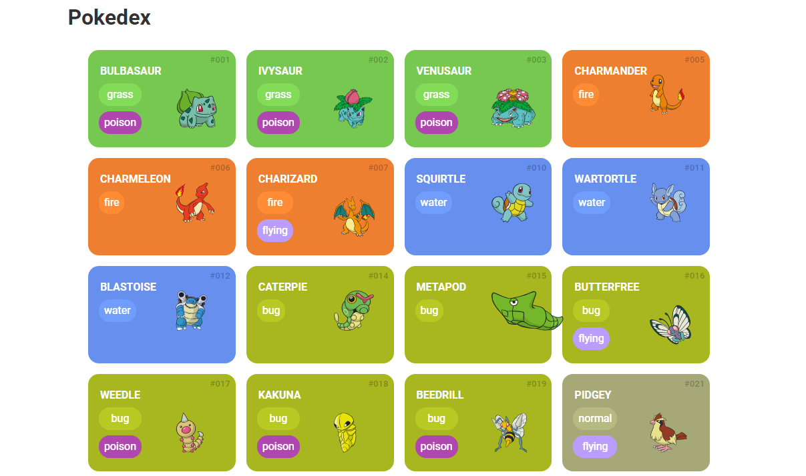

## Pokedex

 A Pokédex é um dispositivo eletrônico fictício dentro do universo Pokémon, usado pelos Treinadores Pokémon para registrar informações sobre diferentes espécies de Pokémon.
 

 
  A palavra "Pokédex" é uma combinação das palavras "Pokémon" e "índex". A função principal de um Pokédex é catalogar e fornecer informações sobre Pokémon, como seus tipos, habilidades, evoluções e habitats.
